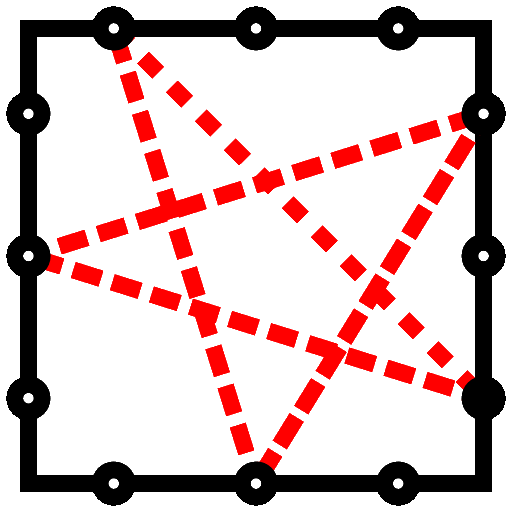
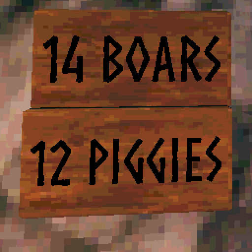
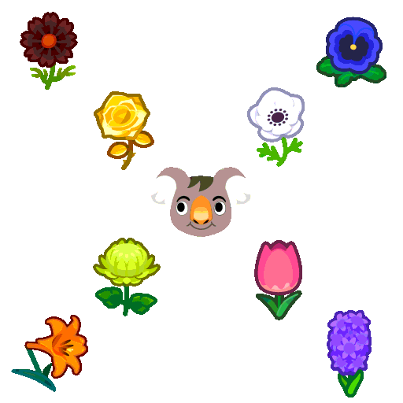

<!-- This HTML is also valid GitHub MarkDown.  Who knew?-->

<h1>
  Joey Parrish
  
</h1>

<a href="#contact">Contact</a>

<h2>Professional Projects</h2>

<table>
  <tr>
    <th colspan="4" style="text-align: center">
      <h3><a href="https://github.com/shaka-project/">
         
        Shaka Project
      </a></h3>
    </th>
  </tr>

  <tr>
    <td valign="top" align="center" width="25%">
      <h4><a href="https://github.com/shaka-project/shaka-player">
        Shaka Player
      </a></h4>
      Streaming media playback on the web.
    </td>
    <td valign="top" align="center" width="25%">
      <h4><a href="https://github.com/shaka-project/shaka-packager">
        Shaka Packager
      </a></h4>
      Streaming media packaging in DASH & HLS.
    </td>
    <td valign="top" align="center" width="25%">
      <h4><a href="https://github.com/shaka-project/shaka-streamer">
        Shaka Streamer
      </a></h4>
      One-step transcoding, packaging, and delivery to cloud storage.
    </td>
    <td valign="top" align="center" width="25%">
      <h4><a href="https://github.com/shaka-project/shaka-lab">
        Shaka Lab Packages
      </a></h4>
      Everything that runs the Shaka lab environment, conveniently packaged for
      Linux, macOS, and Windows.
    </td>
  </tr>

  <tr>
    <td valign="top" align="center" width="25%">
      <h4><a href="https://github.com/shaka-project/generic-webdriver-server/">
        Generic WebDriver Server
      </a></h4>
      Limited WebDriver support for testing on
      Chromecast, ChromeOS, Tizen, and Xbox One.
    </td>
    <td valign="top" align="center" width="25%">
      <h4><a href="https://github.com/shaka-project/webdriver-installer/">
        WebDriver Installer
      </a></h4>
      One-step installation of the correct drivers and versions for your
      installed browsers.
    </td>
    <td valign="top" align="center" width="25%">
      <h4><a href="https://github.com/shaka-project/static-ffmpeg-binaries/">
        Static FFmpeg Binaries
      </a></h4>
      Static binaries for multiple OS & CPU combinations, built from source in
      plain view with GitHub Actions.  (Used by Shaka Streamer.)
    </td>
    <td valign="top" align="center" width="25%">
      <h4><a href="https://github.com/shaka-project/karma-local-wd-launcher/">
        Karma Local WebDriver Launcher
      </a></h4>
      Karma Launcher that launches browsers locally via WebDriver, using
      <a href="https://github.com/shaka-project/webdriver-installer/">WebDriver Installer</a>.
    </td>
  </tr>

  <tr>
    <td valign="top" align="center" width="25%">
      <h4><a href="https://github.com/shaka-project/express-chocolatey-server/">
        Express Chocolatey Server
      </a></h4>
      A simple Chocolatey package server for Express, used to serve <a href="https://github.com/shaka-project/shaka-lab/">Shaka Lab packages</a> for Windows.
    </td>
    <td valign="top" align="center" width="25%">
      <h4><a href="https://github.com/shaka-project/shaka-github-tools/">
        Shaka GitHub Tools
      </a></h4>
      Tools and infrastructure shared among Shaka team projects on GitHub.
    </td>
    <td valign="top" align="center" width="25%">
      <h4><a href="https://github.com/shaka-project/shaka-project.github.io/">
        Shaka Project Documentation
      </a></h4>
      <a href="https://shaka-project.github.io/">Documentation for maintenance and development processes</a> across Shaka projects.
    </td>
    <td valign="top" align="center" width="25%">
      <h4><a href="https://github.com/joeyparrish/shaka-player-ph/">
        Shaka Player Project Health
      </a></h4>
      Tracking <a href="https://joeyparrish.github.io/shaka-player-ph/">Project Health (PH) metrics for Shaka Player</a>.
    </td>
  </tr>

  <tr>
    <td valign="top" align="center" width="25%">
      <h4><a href="https://github.com/google/triage-party/">
         
        Triage Party
      </a></h4>
      Manage issues across GitHub repositories.
    </td>
    <td valign="top" align="center" width="25%">
      <h4><a href="https://github.com/shaka-project/triage-party-config/">
        Shaka Triage Party Config
      </a></h4>
      Configuration and customization for <a href="https://triage-party.shakalab.rocks/">Shaka Team's instance of Triage Party</a>, triaging issues across different categories of projects.
    </td>
    <td valign="top" align="center" width="25%">
      <h4><a href="https://github.com/joeyparrish/chromecast-receivers/">
        Chromecast debugging receivers
      </a></h4>
      Some <a href="https://joeyparrish.github.io/chromecast-receivers/">useful Chromecast receivers for debugging</a>.
    </td>
    <td valign="top" align="center" width="25%">
      
    </td>
  </tr>

  <tr>
    <th colspan="4" style="text-align: center">
      <h3><a href="https://w3c.github.io/encrypted-media/">
         
        Encrypted Media Extensions
      </a></h3>
    </th>
  </tr>

  <tr>
    <td valign="top" align="center" width="25%">
      <h4>EME Spec Editor @W3C</h4>
      <ul align="left">
        <li><a href="https://github.com/w3c/encrypted-media/">GitHub</a></li>
        <li><a href="https://w3c.github.io/encrypted-media/">Editor's Draft</a></li>
      </ul>
    </td>
    <td valign="top" align="center" width="25%">
      <h4><a href="https://github.com/shaka-project/eme-encryption-scheme-polyfill/">
        EME Encryption Scheme Polyfill
      </a></h4>
      A polyfill to add encryption scheme query support to both the EME and
      MediaCapabilities APIs.
    </td>
    <td valign="top" align="center" width="25%">
      <h4>EME Logger Chrome Extension</h4>
      Logs and debugs all activity through EME and related media APIs.
      <ul align="left">
        <li><a href="https://github.com/shaka-project/eme_logger/">GitHub</a></li>
        <li><a href="https://chrome.google.com/webstore/detail/eme-call-and-event-logger/cniohcjecdcdhgmlofniddfoeokbpbpb">Chrome Web Store</a></li>
      </ul>
    </td>
    <td valign="top" align="center" width="25%">
      <h4><a href="https://github.com/shaka-project/trace-anything/">
        Trace Anything
      </a></h4>
      The generic tracing engine behind EME Logger.
    </td>
  </tr>
</table>

<h2>Personal Projects</h2>

<h3>Games</h3>

<table>
  <tr>
    <td valign="top" align="center" width="25%">
      <h4><a href="https://joeyparrish.github.io/wordles-with-friends/">
         
        Wordles with Friends
      </a></h4>
      Pick a word and challenge your friends! 
      <ul align="left">
        <li><a href="https://github.com/joeyparrish/wordles-with-friends/">GitHub</a></li>
        <li><a href="https://joeyparrish.github.io/wordles-with-friends/">Play in Browser</a></li>
      </ul>
    </td>
    <td valign="top" align="center" width="25%">
      <h4><a href="https://joeyparrish.github.io/othello/">
         
        Othello
      </a></h4>
      Classic board game. 
      Pass-and-play while offline (PWA), or play over the internet
      peer-to-peer with WebRTC. 
      <ul align="left">
        <li><a href="https://github.com/joeyparrish/othello/">GitHub</a></li>
        <li><a href="https://joeyparrish.github.io/othello/">Play in Browser</a></li>
      </ul>
    </td>
    <td valign="top" align="center" width="25%">
      <h4><a href="https://joeyparrish.github.io/moonshot/">
         
        MoonShot
      </a></h4>
      A work of interactive fiction. 
      You play as a NASA intern working on the Apollo 11 project, and
      nothing goes wrong! 
      <ul align="left">
        <li><a href="https://github.com/joeyparrish/moonshot/">GitHub</a></li>
        <li><a href="https://joeyparrish.github.io/moonshot/">Play in Browser</a></li>
      </ul>
    </td>
    <td valign="top" align="center" width="25%">
      <h4><a href="https://joeyparrish.github.io/letterboxed/">
        <picture>
          <source srcset="logos/Letterboxed-dark.png" media="(prefers-color-scheme: dark)" />
          <source srcset="logos/Letterboxed.png" media="(prefers-color-scheme: light), (prefers-color-scheme: no-preference)" />
          
        </picture> 
        Letterboxed clone
      </a></h4>
      A recreation of the <a href="https://www.nytimes.com/puzzles/letter-boxed">NYT Letter Boxed Game</a>. 
      Improvements: 
      <ol align="left">
        <li>Offline play</li>
        <li>Archive of past puzzles</li>
        <li>New puzzles generated from English poetry</li>
        <li>Share results button</li>
      </ol>
      <ul align="left">
        <li><a href="https://github.com/joeyparrish/letterboxed/">GitHub</a></li>
        <li><a href="https://joeyparrish.github.io/letterboxed/">Play in Browser</a></li>
      </ul>
    </td>
  </tr>
</table>

<h3>Valheim Mods</h3>

<table>
  <tr>
    <td valign="top" align="center" width="25%">
      <h4><a href="https://github.com/joeyparrish/pokeheim/">
         
        Pokéheim
      </a></h4>
      Catch monsters to fight for you. 
      <ul align="left">
        <li><a href="https://github.com/joeyparrish/pokeheim/">GitHub</a></li>
        <li><a href="https://valheim.thunderstore.io/package/Pokeheim/Pokeheim/">Thunderstore</a></li>
        <li><a href="https://www.nexusmods.com/valheim/mods/1919/">Nexus Mods</a></li>
      </ul>
    </td>
    <td valign="top" align="center" width="25%">
      <h4><a href="https://github.com/joeyparrish/valheim-farmcounter/">
         
        FarmCounter
      </a></h4>
      Keep track of the animals on your farm. 
      <ul align="left">
        <li><a href="https://github.com/joeyparrish/valheim-farmcounter/">GitHub</a></li>
        <li><a href="https://valheim.thunderstore.io/package/joeyparrish/FarmCounter/">Thunderstore</a></li>
        <li><a href="https://www.nexusmods.com/valheim/mods/1952/">Nexus Mods</a></li>
      </ul>
    </td>
    <td valign="top" align="center" width="25%">
      <h4><a href="https://github.com/joeyparrish/valheim-musicmod/">
        <picture>
          <source srcset="logos/MusicMod-dark.png" media="(prefers-color-scheme: dark)" />
          <source srcset="logos/MusicMod.png" media="(prefers-color-scheme: light), (prefers-color-scheme: no-preference)" />
          
        </picture> 
        MusicMod
      </a></h4>
      A base mod that you can depend on to add custom music to your own mod.  Used in Pokéheim. 
      <ul align="left">
        <li><a href="https://github.com/joeyparrish/valheim-musicmod/">GitHub</a></li>
        <li><a href="https://valheim.thunderstore.io/package/joeyparrish/MusicMod/">Thunderstore</a></li>
        <li><a href="https://www.nexusmods.com/valheim/mods/1975/">Nexus Mods</a></li>
      </ul>
    </td>
    <td valign="top" align="center" width="25%">
      
    </td>
  </tr>
</table>

<h3>Misc.</h3>

<table>
  <tr>
    <td valign="top" align="center" width="25%">
      <h4><a href="https://github.com/joeyparrish/total-perspective-vortex">
        <picture>
          <source srcset="logos/TPV-dark.png" media="(prefers-color-scheme: dark)" />
          <source srcset="logos/TPV.png" media="(prefers-color-scheme: light), (prefers-color-scheme: no-preference)" />
          
        </picture> 
        Total Perspective Vortex
      </a></h4>
      Configures services based on templates and a YAML config file, just like
      the name suggests!
    </td>
    <td valign="top" align="center" width="25%">
      <h4><a href="https://github.com/joeyparrish/upfish/">
         
        UpFish
      </a></h4>
      Dynamically making fun of your movies. 
      <ul align="left">
        <li><a href="https://upfish.fans/">Web Site</a></li>
        <li><a href="https://chrome.google.com/webstore/detail/upfish/cjjgmbadhgclcfblcmoamgkbldmcbpbl">Chrome Web Store</a></li>
        <li><a href="https://github.com/joeyparrish/upfish/">GitHub</a></li>
      </ul>
    </td>
    <td valign="top" align="center" width="25%">
      <h4><a href="https://github.com/joeyparrish/lmrtfy/">
        <picture>
          <source srcset="logos/LMRTFY-dark.png" media="(prefers-color-scheme: dark)" />
          <source srcset="logos/LMRTFY.png" media="(prefers-color-scheme: light), (prefers-color-scheme: no-preference)" />
          
        </picture> 
        LMRTFY
      </a></h4>
      A clone of "Let Me Google That For You", with a twist.
      <ul align="left">
        <li><a href="https://rickthat.com/">Web Site</a></li>
        <li><a href="https://github.com/joeyparrish/lmrtfy/">GitHub</a></li>
      </ul>
    </td>
    <td valign="top" align="center" width="25%">
      <h4><a href="https://github.com/joeyparrish/acnh-flowers/">
         
        ACNH Flower Guide for Nerds
      </a></h4>
      A detailed flower breeding guide for Animal Crossing: New Horizons.
      Includes detailed gene sequences, breeding outcome tables, and clear
      layout recommendations.  Plus, appendices!
      <ul align="left">
        <li><a href="https://joeyparrish.github.io/acnh-flowers/">Web Site</a></li>
        <li><a href="https://github.com/joeyparrish/acnh-flowers">GitHub</a></li>
      </ul>
    </td>
  </tr>

  <tr>
    <td valign="top" align="center" width="25%">
      <h4><a href="https://github.com/joeyparrish/ssh-docker-jumpbox/">
        SSH Docker Jumpbox
      </a></h4>
      A simple SSH jumpbox in a Docker container.
    </td>
    <td valign="top" align="center" width="25%">
      <h4><a href="https://github.com/joeyparrish/mpa/">
        Moon Position Algorithm
      </a></h4>
      A C++ algorithm for computing the position of the moon. 
      A stripped-down version of <a href="https://midcdmz.nrel.gov/sampa/">SAMPA</a>
      (Sun And Moon Position Algorithm) that can run on some microcontrollers.
    </td>
    <td valign="top" align="center" width="25%">
      <h4><a href="https://github.com/joeyparrish/get-thee-to-it/">
        get.thee.to.it
      </a></h4>
      Experimental link shortener served entirely from GitHub. 
      Use GitHub Pages deployments as a link shortener, GitHub Actions as the
      UI, and the GitHub repo as a database.
      <ul align="left">
        <li><a href="https://get.thee.to.it/latteart">Sample Short Link</a></li>
        <li><a href="https://github.com/joeyparrish/get-thee-to-it/">GitHub</a></li>
      </ul>
    </td>
    <td valign="top" align="center" width="25%">
      
    </td>
  </tr>

  <tr>
    <td valign="top" align="center" width="25%">
      <h4><a href="https://github.com/joeyparrish/kinetoscope/">
        <picture>
          <source srcset="logos/Kinetoscope-dark.png" media="(prefers-color-scheme: dark)" />
          <source srcset="logos/Kinetoscope.png" media="(prefers-color-scheme: light), (prefers-color-scheme: no-preference)" />
          
        </picture> 
        Kinetoscope
      </a></h4>
      Streaming video for the Sega Genesis / Mega Drive!
      <ul align="left">
        <li><a href="https://joeyparrish.github.io/kinetoscope/">Web Emulator Demo</a></li>
        <li><a href="https://github.com/joeyparrish/kinetoscope/releases">Releases</a></li>
        <li><a href="https://github.com/joeyparrish/kinetoscope/">GitHub</a></li>
      </ul>
    </td>
    <td valign="top" align="center" width="25%">
      <h4><a href="https://github.com/joeyparrish/sega-slides/">
        Sega Genesis Slide Generator and Viewer
      </a></h4>
      Create a Sega Genesis / Mega Drive ROM from a PDF of a slide show.
    </td>
    <td valign="top" align="center" width="25%">
      <h4><a href="https://github.com/joeyparrish/flashkit-md-py/">
        FlashKit MD Python Client
      </a></h4>
      Drive the <a href="https://krikzz.com/our-products/accessories/flashkitmd.html">Krikzz FlashKit Programmer MD</a> to flash Sega Genesis carts from the command-line.
      <ul align="left">
        <li><a href="https://pypi.org/project/flashkit/">PyPi</a></li>
        <li><a href="https://github.com/joeyparrish/flashkit-md-py/">GitHub</a></li>
      </ul>
    </td>
    <td valign="top" align="center" width="25%">
      
    </td>
  </tr>
</table>

<h3>Deprecated</h3>

  
Expand to see deprecated projects.

  <table>
    <tr>
      <td valign="top" align="center" width="25%">
        <h4><a href="https://github.com/joeyparrish/RetCon/">
          <picture>
            <source srcset="logos/RetCon-dark.png" media="(prefers-color-scheme: dark)" />
            <source srcset="logos/RetCon.png" media="(prefers-color-scheme: light), (prefers-color-scheme: no-preference)" />
            
          </picture> 
          RetCon
        </a></h4>
        Wireless PS3 controllers on 8-bit and 16-bit consoles.
        Deprecated in favor of products from
        <a href="https://www.8bitdo.com/">8bitdo.com</a>. 
        <ul align="left">
          <li><a href="https://github.com/joeyparrish/RetCon/">GitHub</a></li>
        </ul>
      </td>
      <td valign="top" align="center" width="25%">
        <h4><a href="https://github.com/shaka-project/shaka-player-embedded">
           
            Shaka Player Embedded
        </a></h4>
        Streaming media playback in iOS native.
        Deprecated due to lack of internal funding and external interest.
      </td>
      <td valign="top" align="center" width="25%">
        <h4><a href="https://github.com/joeyparrish/karma-github-actions-reporter/">
          Karma GitHub Actions Reporter
        </a></h4>
        A Karma plugin to report failed tests via GitHub Actions annotations.
      </td>
      <td valign="top" align="center" width="25%">
        <h4><a href="https://github.com/joeyparrish/apple-logger/">
          Apple Logger
        </a></h4>
        Command-line tool to write to Apple's Unified Logging interface.
      </td>
    </tr>
  </table>

  

<h2 id="contact">Contact</h2>

Email: <a href="mailto:joey.parrish@gmail.com">joey.parrish@gmail.com</a>

video-dev Slack: <a href="https://video-dev.org/">https://video-dev.org/</a>

LinkedIn: <a href="https://www.linkedin.com/in/joey-parrish-64258a297/">https://www.linkedin.com/in/joey-parrish-64258a297/</a>

Pokemon Go: 6171 9255 3006 <a href="logos/trainer-code.png">(QR)</a>

Sorry, I don't do social media.

